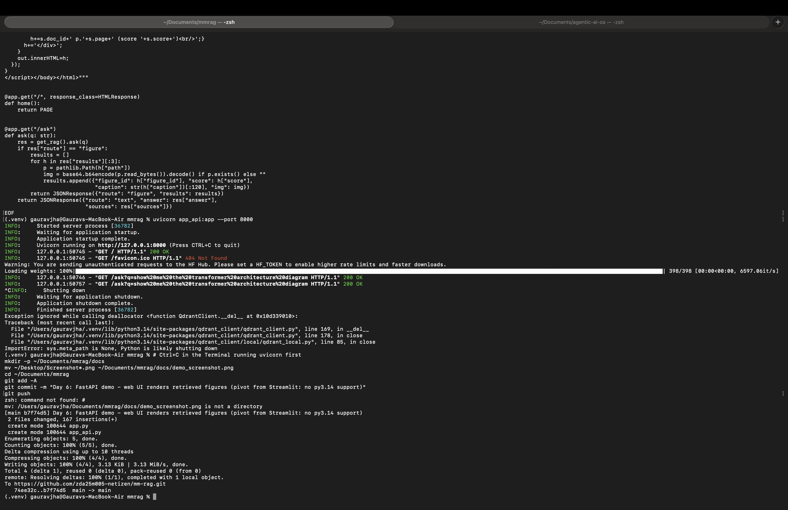

# MM-RAG — Production-Scale Multimodal RAG

End-to-end multimodal RAG over ML papers: PDF ingestion (text + figures),
CLIP figure search with hybrid scoring, query routing, vector retrieval
(Qdrant), cited answers, and an eval harness. Building toward a fine-tuned
reranker with a novel figure-aware hard-negative method + full MLOps loop.

## Status

**Week 1 — core RAG (done)**
- [x] PDF ingestion + figure extraction (PyMuPDF): 12 real arXiv papers, 331 pages, 412 figures
- [x] Overlapping chunking (400 tok / 80 overlap) -> 758 chunks
- [x] Pluggable embedders: TF-IDF+SVD (dev) / sentence-transformers (GPU)
- [x] Qdrant index (local mode), cosine search
- [x] RAG pipeline with citations; stub generator (GPT-4o-mini pluggable)
- [x] Eval harness: recall@k + MRR on 16 labeled queries

**Week 2 — multimodal retrieval (done)**
- [x] Day 2: figure metadata — every figure linked to paper/page/caption (13% strict caption match, page-text fallback; known issue: in-order matching)
- [x] Day 3: CLIP embeddings (clip-ViT-B-32) for all 412 figures. Finding: image-only sims are low (0.27–0.34) on scientific diagrams
- [x] Day 4: named-vector figure index (image + caption) with hybrid search. **Hybrid fixes the architecture-diagram query: correct figure to #1 (0.58 vs 0.29)** — bounded by caption quality
- [x] Day 5: query router — unified ask() routes figure vs text queries (6/6 correct on demo set)
- [x] Day 6: FastAPI web demo - figures rendered in browser (Streamlit pivot: no py3.14 support yet)
- [x] Day 7: figure-retrieval eval - hybrid fig R@1 0.75 vs 0.33 image-only (table below)

**Week 3 — neural retrieval + fine-tuned reranker (done)**
- [x] Day 1: config-driven embedders, per-model collections; TF-IDF vs bge-small A/B (tie at doc level - ceiling-bound eval, table below)
- [x] Day 2: chunk-level gold set (18 paraphrased queries) + bge query prefix (+23pts R@1, free win)
- [x] Day 3: hard-negative mining - 753 positives + 2259 negatives (known limit: false negatives)
- [x] Day 4: reranker LoRA training notebook (Colab T4) + smoke test
- [x] Day 5: trained reranker v1 (LoRA, 3 epochs) - val acc 0.77->0.98, 74K params (0.33%)
- [x] Day 6: two-stage retrieval - bge retrieve 50 -> cross-encoder rerank -> top 5
- [x] Day 7: reranker eval - cross-encoder +11pts R@1; naive-mined LoRA underperformed base (diagnosed; motivates Week-6 mining novelty)

**Week 4 — LLM agent + eval harness (done)**
- [x] Day 1: GPT-4o-mini generator live + bge query prefix baked into pipeline (clean cited answers)
- [x] Day 2: LangGraph agent (retrieve/grade/reformulate/generate). Finding: self-correction bounded by retrieval recall -> hallucinates when retrieval fails
- [x] Day 3: query decomposition - splits multi-part questions, retrieves per sub-question, synthesizes from multiple papers
- [x] Day 4: tool calling - safe AST calculator (no exec) verifies numeric claims when needed
- [x] Day 5: RAGAS-style eval (LLM judge) - faithfulness/relevance/context-precision; context-precision localizes failures to retrieval recall
- [x] Day 6: claim-level judge - citation precision 1.0; 'say if insufficient' prompt turns hallucination into honest refusal
- [x] Day 7: validated judge vs human labels - raw agreement 0.67/kappa 0.31; disagreement analysis shows ~3/4 were human labeling errors (judge reliable; single-annotator labeling is noisy)

**Week 5 — harden the core + fix retrieval recall (planned)**
- [ ] Day 1: diagnose the retrieval-recall gap (the recurring bottleneck across Weeks 3-4)
- [ ] Day 2: hybrid retrieval - add BM25/keyword search fused with dense (recall boost)
- [ ] Day 3: add a coverage / answer-rate metric (catch faithful-but-unhelpful refusals)
- [ ] Day 4: pytest unit tests for pipeline components + CI
- [ ] Day 5: wire the agent into the FastAPI demo; Dockerize
- [ ] Day 6: re-run full eval (retrieval + answer-quality) with hybrid retrieval
- [ ] Day 7: freeze v1.0 core - tag release, polish README

## Quickstart

```bash
pip install pymupdf qdrant-client scikit-learn pyyaml matplotlib reportlab sentence-transformers

python scripts/download_arxiv.py --out data/raw   # real corpus
python scripts/run_pipeline.py build              # text: ingest -> chunk -> embed -> index
python scripts/build_figures.py                   # figure metadata
python scripts/embed_figures.py                   # CLIP embeddings
python scripts/build_figure_index.py build        # figure index (image+caption vectors)

python scripts/ask.py "How does LoRA reduce trainable parameters?"    # text route
python scripts/ask.py "show me the transformer architecture diagram"  # figure route
```

## Layout

```
src/mmrag/
  ingest.py        # PDF -> page text + figure PNGs
  chunk.py         # overlapping chunks
  embed.py         # TfidfEmbedder (dev) / STEmbedder (GPU)
  clip_embed.py    # CLIP image+text embeddings
  index.py         # text chunk index (Qdrant)
  figure_index.py  # figure index: named vectors (image+caption), hybrid search
  router.py        # unified ask() - figure vs text routing
  rag.py           # query pipeline, stub + OpenAI generators
  figures.py       # figure -> page/caption metadata
  eval.py          # recall@k, MRR
scripts/           # build | ask | demo drivers
configs/config.yaml
data/ raw | processed | figures
```

## Roadmap

Weeks 3–10: bge embeddings + LoRA-fine-tuned reranker (vs DocReRank-style
baseline), LangGraph agent, GPT-4o-mini generator, **novel figure-aware
hard-negative mining** (controlled experiment, 3–5 seeds), scale to 1M docs
(quantized + sharded Qdrant), load testing (QPS, p99), drift detection,
auto-retrain, canary deploys.

## Demo



## Figure-retrieval eval (Day 7, 12 labeled queries)

| mode | fig R@1 | fig R@3 | doc R@1 | fig MRR |
|---|---|---|---|---|
| image-only (a=1.0) | 0.333 | 0.333 | 0.500 | 0.333 |
| hybrid (a=0.5) | **0.750** | 0.750 | 0.750 | 0.750 |
| caption-only (a=0.0) | 0.833 | 0.833 | 0.833 | 0.833 |

Findings: hybrid more than doubles figure recall vs image-only. Caption-only
slightly edges hybrid (one query at n=12), indicating CLIP ViT-B-32 image
vectors add little signal on scientific diagrams — motivates a stronger
visual encoder (ColPali, GPU phase) and alpha tuning. Caveats: small n,
caption-like query phrasing biases toward caption matching.

## Text retrieval: TF-IDF vs bge-small (Week 3 Day 1, doc-level, n=16)

| model | R@1 | R@5 | MRR |
|---|---|---|---|
| TF-IDF+SVD | 0.938 | 1.000 | 0.953 |
| bge-small-en-v1.5 | 0.938 | 0.938 | 0.938 |

Effectively a tie (1-query delta): doc-level eval on 12 papers is ceiling-bound,
and the corpus is lexically easy (rare exact terms favor TF-IDF). Neural gains
need a harder eval: chunk-level labels + paraphrased queries (next), plus the
bge query prefix. bge stays as default going into reranker work.

## Chunk-level retrieval eval (Week 3 Day 2, bge-small, 18 paraphrased queries)

Passage-level: correct = a top-k chunk is from the right paper AND contains a gold phrase.

| variant | chunk R@1 | R@3 | R@5 | MRR |
|---|---|---|---|---|
| bge, no query prefix | 0.444 | 0.722 | 0.833 | 0.578 |
| bge + query prefix | **0.667** | 0.778 | 0.889 | **0.738** |

Two findings: (1) chunk-level eval has real headroom (unlike doc-level) — the
yardstick for reranking. (2) The recommended bge query prefix is a free +23pts
R@1 / +16pts MRR. This becomes the dense-retrieval baseline the reranker must beat.

## Reranker eval (Week 3 Day 7, chunk-level, 18 queries)

| mode | R@1 | R@3 | R@5 | MRR |
|---|---|---|---|---|
| dense only (bge) | 0.667 | 0.778 | 0.889 | 0.738 |
| dense + base cross-encoder | **0.778** | **0.889** | **1.000** | **0.858** |
| dense + LoRA v1 (ours) | 0.611 | 0.833 | 0.944 | 0.752 |

**Finding (negative result, diagnosed):** the cross-encoder reranker clearly
helps (dense+base beats dense-only everywhere). But our LoRA fine-tuning
*underperforms the off-the-shelf model* on R@1/MRR. Root cause: the reranker
was trained on pseudo-queries (chunk slices) with false-negative-noisy hard
negatives — a distribution mismatch vs real queries. High training val-acc
(0.98) did not transfer. This motivates the Week-6 contribution: better
(figure-aware) hard-negative mining to fix the training signal. Current
production config: dense + base cross-encoder.

## Answer-quality eval (Week 4 Day 5, RAGAS-style LLM judge, 6 queries)

| metric | avg |
|---|---|
| faithfulness | 0.667 |
| answer relevance | 0.583 |
| context precision | 0.558 |

Per-query: 4/6 score high (faithfulness ~1.0); 2/6 score ~0 — and both have
context_precision 0.0, i.e. retrieval returned irrelevant passages. Faithfulness
correctly flags the Day-2 hallucination ("word-order" query) at 0.0. Key finding:
**answer quality is gated by retrieval recall** - when the right passage is
retrieved, faithfulness is near-perfect; failures trace to retrieval, not
generation. Motivates retrieval/mining improvements (Week 6).
